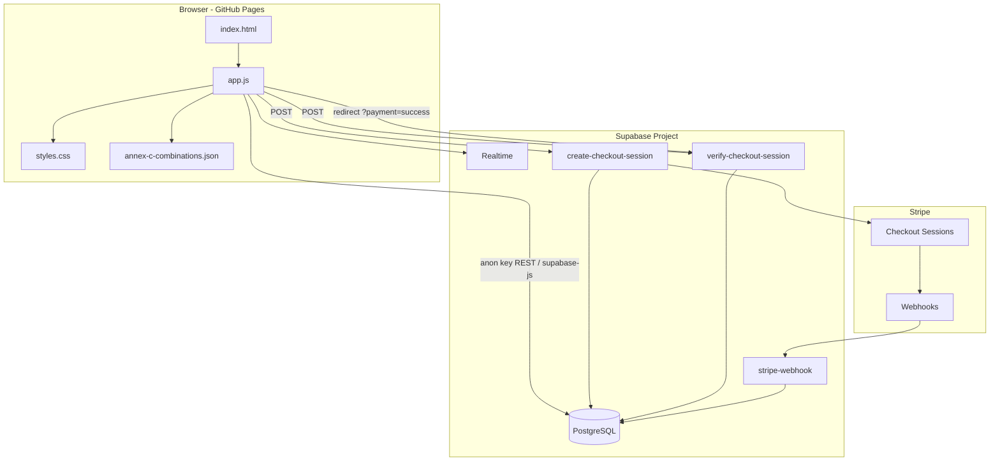

# World Cup of Ash — Technical Product Document

**Product:** Ash's World Cup 2026 prediction pool  
**Production URL:** [worldcupofash.com](https://worldcupofash.com)  
**Repository:** [ashishfernandez/ashish-world-cup-2026](https://github.com/ashishfernandez/ashish-world-cup-2026)  
**Document type:** Tech stack & architecture (PRD-style)  
**Last updated:** June 2026  

---

## 1. Executive summary

World Cup of Ash is a **friends-only World Cup 2026 bracket pool** where participants pay a per-entry buy-in, submit group standings and a full knockout bracket, and compete on a shared leaderboard. The product is intentionally **simple to operate**: a static web front end on GitHub Pages, a single Supabase project as the shared database, and Stripe Checkout for payments—no custom backend server, no build step, and no framework runtime in production.

The app optimizes for **real-time shared state** (every visitor sees the same submissions and official results), **FIFA-accurate knockout logic** (including Annex C third-place assignment), and a **premium responsive UI** (desktop sidebar, mobile bottom navigation).

---

## 2. Product goals

| Goal | How the stack supports it |
|------|---------------------------|
| Low cost hosting | GitHub Pages serves static HTML/CSS/JS only |
| Zero build pipeline | No npm/webpack required to deploy; edit and push |
| Shared global pool | Supabase Postgres + Realtime + polling |
| Paid entries | Stripe Checkout + Edge Functions promote rows after payment |
| Admin-controlled scoring | `official_results` JSON drives leaderboard recalculation |
| Mobile + desktop | CSS breakpoints; separate mobile nav pattern |

### Non-goals (current version)

- User accounts / OAuth login  
- Server-side bracket validation before payment (client validates; server stores payload)  
- Multi-tenant pools (single pool per deployment)  
- Native iOS/Android apps  

---

## 3. User roles & surfaces

| Role | Capabilities |
|------|----------------|
| **Visitor / participant** | View leaderboard, brackets, groups; run 6-step submit wizard; pay via Stripe |
| **Pool host (admin)** | Password-gated Admin tab: group standings, 8 third-place picks, match results, participant delete, toggles for group scoring & Stripe |
| **System** | Stripe webhooks and verify endpoint promote paid entries |

### Main UI tabs

1. **Leaderboard** — Rankings, medal picks, group/knockout/total points  
2. **Group Stages** — Per-participant group tables (A–L)  
3. **Bracket Stages** — FIFA-style horizontal knockout tree with PT kickoff times  
4. **Points Outline** — Scoring rules copy  
5. **Tourney Terms** — Pool legal / financial terms  
6. **Admin Control** — Official results simulator (host only)  

---

## 4. System architecture



### Request flow: submit & pay

1. User completes wizard steps 1–5 (name, groups, 8 third places, bracket, review).  
2. Step 6 calls **`create-checkout-session`** with full participant payload.  
3. Edge Function inserts **`pending_submissions`**, creates Stripe session, returns URL.  
4. User pays on Stripe; redirect to `?payment=success&session_id=...`.  
5. Client calls **`verify-checkout-session`** → row promoted to **`submissions`**.  
6. **`stripe-webhook`** (`checkout.session.completed`) promotes as backup if the tab closes early.  
7. All clients refresh via Realtime / 8s polling / tab focus.

---

## 5. Technology stack

| Layer | Technology | Version / notes |
|-------|------------|-----------------|
| **Hosting** | GitHub Pages | Custom domain via `CNAME` → `worldcupofash.com` |
| **Markup** | HTML5 | Single-page shell in `index.html` |
| **Styling** | Vanilla CSS3 | Design tokens, light/dark theme, ~3.9k lines `styles.css` |
| **Application logic** | Vanilla JavaScript | ~3.7k lines `app.js`, no bundler |
| **Icons** | Font Awesome | 6.4.0 CDN |
| **Fonts** | Google Fonts | Outfit (headings), Inter (body) |
| **Flags** | flagcdn.com | PNG flags (Windows emoji fallback) |
| **Database** | Supabase (PostgreSQL) | Project ref in repo config |
| **DB client** | `@supabase/supabase-js` | 2.106.2 UMD from jsDelivr |
| **Serverless API** | Supabase Edge Functions | Deno runtime |
| **Payments** | Stripe Checkout | API via `stripe` npm on Deno |
| **Static data** | JSON | `annex-c-combinations.json` (495 FIFA combinations) |

**Explicitly not used:** React, Vue, Next.js, Node.js app server, Firebase, custom VPS, Docker in production.

---

## 6. Frontend architecture

### 6.1 File responsibilities

| File | Responsibility |
|------|----------------|
| `index.html` | Layout: sidebar, tab panels, wizard modal, admin UI skeleton |
| `styles.css` | Themes, bracket layout, leaderboard, responsive breakpoints |
| `app.js` | State, rendering, scoring, Supabase sync, wizard, Stripe orchestration |
| `annex-c-combinations.json` | FIFA Annex C lookup for third-place → R32 away slots |
| `favicon.jpg` | Tab icon |

Cache busting: query strings on `styles.css` and `app.js` (e.g. `?v=20260608f`) after deploys.

### 6.2 Client state model

Central object **`STATE`** holds:

- Active tab and selected participant for bracket/groups views  
- Wizard step  
- **`participants`** map (includes `draft`, `actuals`, and all paid submissions)  
- **`officialResults`** (match winners, advancing teams, admin toggles)  

**Source of truth for submissions:** Supabase `submissions` table. LocalStorage is used only as a **read cache** when cloud fetch fails—not as authority for the global pool.

### 6.3 Responsive behavior

| Breakpoint | Layout |
|------------|--------|
| **Desktop** (>1024px) | Fixed left sidebar: nav, announcements, submit, pool setup / winnings; scrollable sidebar on short laptop heights |
| **Tablet** (≤1024px) | Horizontal nav; pool meta card hidden |
| **Mobile** (≤768px) | Bottom icon nav (evenly spaced); full-width submit bar above nav; leaderboard table horizontal scroll |

### 6.4 Key UI modules (in `app.js`)

- **Leaderboard** — Sort by total points; medal pick badges with flag images  
- **FIFA bracket renderer** — Pair-based columns, SVG connectors, official-actuals checkmarks  
- **Group standings** — Sortable lists per group A–L  
- **Submit wizard** — 6 steps including Stripe payment when enabled  
- **Admin simulator** — Official group order, 8 third-place selection, per-match winners  
- **Scoring engine** — Group + progressive knockout points; “any-path” rule for knockouts  

---

## 7. Backend & data layer (Supabase)

### 7.1 Project

- **URL:** `https://ovfmmszhlkedypfveyxj.supabase.co` (configured in `app.js`)  
- **Client auth:** Supabase **anon** publishable key in front-end (public by design)  
- **Privileged ops:** Edge Functions use **service role** (server-only secrets)

### 7.2 Tables

| Table | Purpose | Client access |
|-------|---------|---------------|
| **`submissions`** | Locked participant entries (`id` text PK, `data` jsonb) | Public RLS: select/insert/update/delete for `anon` |
| **`official_results`** | Single row `id = 'current'` with admin outcomes | Public RLS: read/write for `anon` |
| **`pending_submissions`** | Pre-payment holds + Stripe session id | **No public policies** — Edge Functions only |

#### `submissions.data` shape (conceptual)

```json
{
  "id": "sub_1738123456789",
  "name": "Ashish",
  "avatar": "https://api.dicebear.com/...",
  "champ": "BRA",
  "groupStandings": { "A": ["MEX", "RSA", "KOR", "CZE"], "...": [] },
  "selectedThirds": ["KOR", "TUN", "..."],
  "bracketPicks": { "1": "GER", "...": "32": "BRA" },
  "submitted": true,
  "onboarded": true
}
```

### 7.3 Row Level Security (RLS)

The pool uses **open RLS policies** on `submissions` and `official_results` so the static site can read/write without login. This is appropriate for a private friends pool with a shared anon key, but it is **not** strong multi-user security—anyone with the key can modify data if they inspect the client.

**`pending_submissions`** is locked down; only service role can access.

### 7.4 Sync strategy

| Mechanism | Interval / trigger |
|-----------|-------------------|
| **Polling** | Every 8 seconds |
| **Realtime** | Postgres changes on `submissions`, `official_results` |
| **Visibility** | Refresh when tab becomes visible |
| **REST fallback** | If `supabase-js` fails (CDN blocked, etc.) |
| **Local cache** | Read-only fallback if cloud unreachable |

Sidebar status: **LIVE GLOBAL POOL** / warning / error based on sync health.

### 7.5 Realtime

Enable replication for `submissions` and `official_results` in Supabase Dashboard (see `supabase-setup.sql` comments).

---

## 8. Payments (Stripe)

| Item | Value |
|------|--------|
| Entry fee | **$15 USD** (`STRIPE_ENTRY_FEE_CENTS=1500`) |
| Unlimited entries | Each submission = separate checkout |
| Client flag | `PAYMENT_CONFIG.required` in `app.js` (set `false` for local dev without Stripe) |

### Edge Functions

| Function | Role |
|----------|------|
| `create-checkout-session` | Insert pending row; create Stripe Checkout session |
| `verify-checkout-session` | On return URL; verify session paid; promote to `submissions` |
| `stripe-webhook` | Backup promotion on `checkout.session.completed` |

Deployed with **`--no-verify-jwt`** so the static site can call them with anon key + CORS.

**Operational doc:** see [`STRIPE_SETUP.md`](STRIPE_SETUP.md) and [`scripts/deploy-stripe-functions.ps1`](scripts/deploy-stripe-functions.ps1).

---

## 9. Game logic & data rules

### 9.1 Scoring (max 1000 pts)

| Stage | Points |
|-------|--------|
| Each correct group qualifier (32 teams) | 5 (max 160) |
| R32 winner picks | 10 per team (max 160) |
| R16 | 20 (max 160) |
| Quarters | 40 (max 160) |
| Semis | 80 (max 160) |
| Bronze match | 40 (max 40) |
| Champion | 160 (max 160) |

**Any-path rule:** Knockout points credit if the predicted team reaches that round in the **official** tournament, regardless of bracket path.

### 9.2 FIFA knockout mapping

- **32 knockout matches** with venues, PT kickoff times, default slot codes (e.g. `1E`, `3ABCDF`)  
- **Annex C:** 495 valid third-place group combinations loaded from JSON; admin (or host actuals) picks which 8 of 12 third-place groups qualify—**order does not change matchups**  
- Admin and user bracket builds share **`buildBracketFromStandings()`** for consistency  

---

## 10. Deployment & operations

### 10.1 Production deploy

1. Push to **`main`** on GitHub.  
2. GitHub Pages serves static files from repo root.  
3. Bump `?v=` on `styles.css` / `app.js` when caching stale assets.  
4. Ensure `annex-c-combinations.json` and `CNAME` are deployed with the site.

### 10.2 Local development

```bash
git clone https://github.com/ashishfernandez/ashish-world-cup-2026.git
cd ashish-world-cup-2026
npx serve .
```

Open the served URL (or `index.html`). For Stripe end-to-end, use Supabase Edge Functions + test keys per `STRIPE_SETUP.md`.

### 10.3 SQL setup (one-time / migrations)

| Script | Purpose |
|--------|---------|
| `supabase-setup.sql` | Core tables + RLS + delete policy |
| `supabase/migrations/20260602_stripe_payments.sql` | `pending_submissions` table |

Run in Supabase SQL Editor if not already applied.

### 10.4 Related documentation

| Doc | Contents |
|-----|----------|
| [`README.md`](README.md) | Features, rules summary, quick start |
| [`STRIPE_SETUP.md`](STRIPE_SETUP.md) | Stripe + Supabase secrets, deploy, test cards |

---

## 11. Security & risk notes

| Area | Current posture | Recommendation |
|------|-----------------|----------------|
| Admin tab | Client-side password prompt | Acceptable for friends pool; not enterprise auth |
| Anon RLS | World-writable submissions/results | Keep URL/key private; monitor abuse |
| Service role | Edge Functions only | Never expose in client |
| Stripe | Webhook signature verification | Required in `stripe-webhook` |
| PII | Display names in jsonb | Minimal collection |

---

## 12. Configuration reference

### Front-end (`app.js`)

```javascript
const SUPABASE_URL = 'https://ovfmmszhlkedypfveyxj.supabase.co';
const SUPABASE_ANON_KEY = '...'; // publishable anon key

const PAYMENT_CONFIG = {
    required: true,
    entryFeeDisplay: '$15.00',
    productLabel: "Ash's WC Tourney Pool Entry",
};

const CLOUD_POLL_INTERVAL_MS = 8000;
```

### Edge Function secrets (Supabase)

| Secret | Example |
|--------|---------|
| `STRIPE_SECRET_KEY` | `sk_test_...` / `sk_live_...` |
| `STRIPE_WEBHOOK_SECRET` | `whsec_...` |
| `STRIPE_ENTRY_FEE_CENTS` | `1500` |
| `STRIPE_PRODUCT_NAME` | Optional label |

`SUPABASE_URL` and `SUPABASE_SERVICE_ROLE_KEY` are injected automatically in Edge Functions.

---

## 13. Repository structure

```
ashish-world-cup-2026/
├── index.html              # App shell
├── app.js                  # Application engine
├── styles.css              # UI system
├── annex-c-combinations.json
├── favicon.jpg
├── CNAME                   # worldcupofash.com
├── README.md
├── STRIPE_SETUP.md
├── TECH_STACK.md           # This document
├── supabase-setup.sql
├── supabase/
│   ├── config.toml
│   ├── migrations/
│   │   └── 20260602_stripe_payments.sql
│   └── functions/
│       ├── create-checkout-session/
│       ├── verify-checkout-session/
│       ├── stripe-webhook/
│       └── _shared/          # CORS, promote helper
└── scripts/
    └── deploy-stripe-functions.ps1
```

---

## 14. Future enhancements (optional backlog)

- Authenticated admin (Supabase Auth or magic link)  
- Stricter RLS (insert-only submissions via Edge Function after payment only)  
- Email receipt / entry confirmation  
- Automated GitHub Actions deploy workflow documentation  
- Rate limiting on Edge Functions  
- Audit log for admin changes  

---

## 15. Document history

| Date | Change |
|------|--------|
| Jun 2026 | Initial tech stack / PRD-style document |

---

*This document describes the stack as implemented in the repository at time of writing. For payment and database setup steps, follow `STRIPE_SETUP.md` and `supabase-setup.sql`.*
